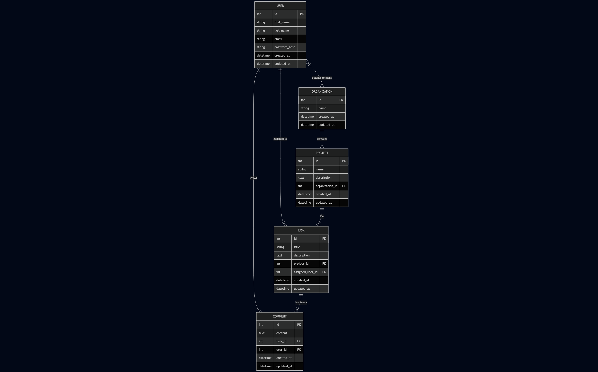
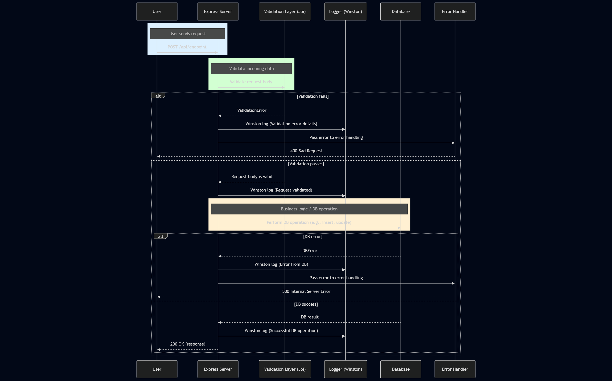
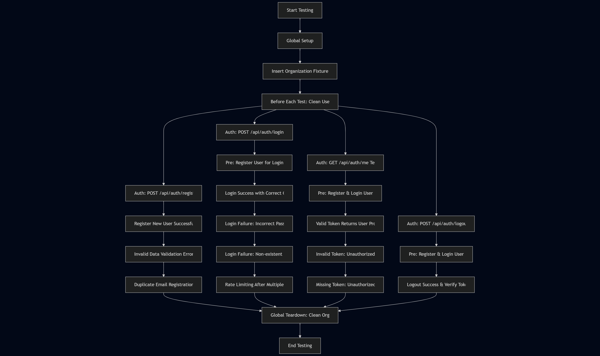

# Group To-Do application backend

This is the backend of a **group-based to-do application**, built with **Node.js**.

It supports features like user register, login, and project management for collaborative teams.

---

## Project Structure

```
src/
├── config/
├── controllers/
├── middlewares/
├── services/
├── utils/
├── db/
├── routes/
├── validations/
└── app.js
tests/
├── fixtures/
├── integrations/
├── units/
├── globalSetup.js
├── globalTeardown.js
└── setup.js
```

---

Here is the diagrams for our system.

- database architecture diagram



- system workflow diagram



- integration test diagram for authentication



---

## Tech Stack

- **Node.js** - Javascript runtime
- **Express** - Web framework for backend
- **Jest** - Testing library
- **Winston** - Logging tools
- **Knex** - PostgreSQL ORM
- **PostgreSQL** - Database for storing users, projects, and tasks
- **dotenv** - Environment variable management

---

## Installation and Setup

1. Clone the repo.

```
git clone https://github.com/masterwww1/group-todo-application-backend.git

cd group-todo-application-backend
```

2. Install dependencies.

```
npm install
```

3. Run the app
```
npm start
```

4. Run tests
```
npm test
```

---

## Possible Improvements

If I had more time, here's what I would add or improve:

- Implement role-based access control
- Add task management functionality
- Add full integration tests and unit tests for all the functionality
- Improve Error handling and validation

---